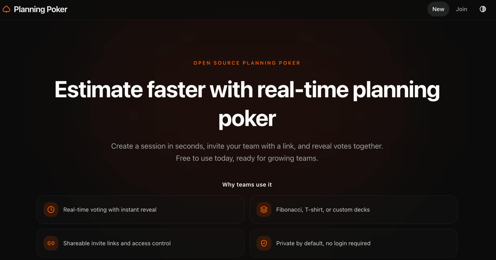

# Open Poker Planning

Real-time planning poker for agile teams. Create a room, share a link, and estimate together. No account, nothing to install for players.

**Live at [openpokerplanning.com](https://openpokerplanning.com)** (currently in private beta, behind an access code)




<!-- Best upgrade here: replace the image above with a short GIF of one full round (create room, vote, reveal, confetti). -->

## Features

- Real-time voting synced across everyone in the room, powered by Convex subscriptions.
- No login. Rooms are token-based: share an invite link and people join instantly.
- Server-scheduled round timer to keep estimation sessions moving.
- Confetti on reveal when the table agrees.
- Optional access-code gate to keep an instance private.
- Bilingual interface (English and French).

## Built with

Next.js 16 (App Router), React 19, TypeScript, Convex (realtime backend and database), Tailwind CSS v4 with Base UI, Oxlint, Oxfmt, Vitest. Deployed on Vercel.

## Timer behavior

Starting or resuming the timer schedules its deadline as an internal Convex mutation. The server reveals the round at that deadline even if the moderator closes or backgrounds their browser; paused, reset, restarted, manually revealed, or deleted games make older scheduled tasks harmless no-ops. Auto-reveal remains an earlier trigger when every active player has voted, while timer expiry always reveals. When sound is enabled, each connected client attempts to play the notification from the server completion event; browser autoplay policies can still block it.

## Data retention

Games become eligible for permanent deletion after **30 days without a recorded game action**, measured from `games.updatedAt`. Voting, managing the round, joining/leaving, and creating invitations renew that timestamp; simply keeping a tab open does not. A daily Convex cron at **03:17 UTC** deletes eligible games with their players and invitations, in indexed batches of 10. Concurrent activity is checked within the deletion transaction. Existing scheduled timer completions become harmless no-ops after deletion.

Invite links expire **30 days after creation**, including legacy links. Expired invites no longer consume the active invite quota; their rows remain until normal slot recycling or game deletion, preserving revocation and legacy-fallback semantics. A member can issue a new link for an active game.

The browser keeps at most 20 recent entries, prunes dated entries after 30 days without a local visit, and timestamps entries on the next visit. Historical entries without a timestamp are retained until revisited; a link to a deleted game returns the existing not-found page. Browser history is not an authoritative list of games still on the server.

Deploying the Convex functions enables this policy for existing data at the next scheduled run. Inspect the target database volumes and `updatedAt` values and export a backup before the first production deployment. Each valid game is bounded to 50 player rows and 100 invite rows; investigate legacy records exceeding those limits before enabling the purge on that database.

## How it works (security)

- Access is **token-based**, no login required.
- Create, join, invite, leave, and session flows go through `app/api/**` Route Handlers, because they need HttpOnly cookie access.
- Gameplay actions (vote, reveal, reset, timer, auto-reveal, remove player, delete game) call Convex mutations directly from the browser, authorized by token hashes.
- Tokens are **256-bit random values stored in HttpOnly cookies**. Convex stores only **SHA-256 hashes**, which the browser presents as bearer credentials for direct mutations.
- The server preloads the authorized viewer state; `usePreloadedQuery` reuses it for the initial render and subscribes to subsequent updates. Other players' votes remain masked before reveal.
- Public Route Handlers use a bounded, in-memory rate limiter with both a global per-IP budget and endpoint-specific budgets. This protection is best-effort per server instance; use a distributed limiter before removing the private access gate.
- If neither `x-forwarded-for` nor `x-real-ip` is set by the deployment proxy, requests share the `unknown` IP bucket and therefore the same global budget.

## Analytics & privacy

Analytics is optional: leave the analytics environment variables unset to disable it. When enabled, both tools are cookieless. PostHog runs memory-only with no autocapture and no session recording; Umami is self-hosted. No analytics identity is stored in cookies or localStorage. The app captures pageviews plus two product events with pseudonymous game ids and non-secret metadata: game created (game type, cards count, whether members can manage the session, locale) and game joined (join source, join reason, locale).

## Getting started

```bash
pnpm install
pnpm exec convex dev         # long-running: generates convex/_generated and fills the Convex vars in .env.local
```

For optional overrides such as analytics or the access gate, copy only the relevant commented variables from `.env.example` into `.env.local` after Convex has written its variables.

Create the shared development secret once, without putting its value in shell history:

```bash
task_service_secret="$(openssl rand -hex 32)"
printf '\nCONVEX_SERVICE_SECRET=%s\n' "$task_service_secret" >> .env.local
printf '%s' "$task_service_secret" | pnpm exec convex env set CONVEX_SERVICE_SECRET
unset task_service_secret
```

Then, with `pnpm exec convex dev` still running, start Next.js in another terminal:

```bash
pnpm dev
```

Open http://localhost:3000.

## Environment

| Variable | Required | Notes |
|---|---|---|
| `NEXT_PUBLIC_CONVEX_URL` | yes | Convex deployment URL (public) |
| `CONVEX_DEPLOYMENT` | yes | Convex deployment (server-only) |
| `CONVEX_SERVICE_SECRET` | yes | Shared server secret configured in both Next.js and Convex, used to authorize create/join mutations |
| `SITE_URL` | recommended | Absolute URL for SEO metadata and sitemap (server-only) |
| `SITE_ACCESS_CODE` | optional | Enables the global access-code gate at `/access` (server-only) |
| `NEXT_PUBLIC_POSTHOG_KEY`, `NEXT_PUBLIC_POSTHOG_HOST` | optional | PostHog analytics (cookieless) |
| `NEXT_PUBLIC_UMAMI_HOST`, `NEXT_PUBLIC_UMAMI_WEBSITE_ID` | optional | Self-hosted Umami analytics |
| `NEXT_PUBLIC_TIMER_DEBUG` | optional | Timer debug presets in development |
| `ALLOWED_DEV_ORIGINS` | optional | Comma-separated origins allowed to reach `next dev` |

## Commands

```bash
pnpm dev      # develop
pnpm lint     # Oxlint (including @shadcn/lint)
pnpm lint:ui  # lint app/ and components/ only
pnpm lints    # Oxfmt check, Oxlint and TypeScript
pnpm format   # format files and sort imports with Oxfmt
pnpm lint:fix # apply safe Oxlint fixes
pnpm test     # Vitest
pnpm build    # production build
pnpm start    # run the production build
```

### Design-system lint

[`@shadcn/lint`](https://github.com/shadcn-ui/lint) is registered through
Oxlint in `.oxlintrc.json`. `pnpm lint` checks the repository, while
`pnpm lint:ui` limits the same checks to `app/` and `components/`.
Oxfmt handles formatting and import sorting through `.oxfmtrc.json`.
`pnpm lints` runs the formatter check, lint and TypeScript checks in CI.

All six `shadcn/*` rules are enabled as errors, with contracts for the
existing components and theme. Oxlint also runs type-aware checks through
`oxlint-tsgolint`, including unhandled and misused promises. See
[design rules and exceptions](docs/design-rules.md) before adding a new
variant, theme token or lint exception.

With `@shadcn/lint` 0.1.0, its transitive `@typescript-eslint` 8.70.0
dependencies declare TypeScript `<6.1.0`, while this project uses 7.0.2.
`pnpm peers check` still reports this mismatch. The enabled Shadcn and native
Oxlint type-aware rules have been exercised on this project.

### Migration from Biome

The rule sets are not identical: Biome-specific CSS checks, cognitive
complexity, accumulating spreads, unused template literals and the
route-specific literal-key check are not reproduced. Generated files,
public assets and `*.config.*` stay out of scope. Oxfmt also leaves Markdown,
YAML and TOML untouched, matching the previous formatting scope. Its import
sorting preserves side-effect import order. VS Code uses the recommended
`oxc.oxc-vscode` extension.

## Deploy

See [maintenance notes](docs/maintenance.md) for retained legacy contracts and the checks required before narrowing the data schema.

Deploy on Vercel and set the same environment variables in the project settings. Convex runs as the realtime backend. Set `CONVEX_SERVICE_SECRET` to the same random value in Vercel and in the production Convex deployment with `pnpm exec convex env set --prod CONVEX_SERVICE_SECRET`. Omitting the value makes the CLI read it interactively or from stdin instead of saving it in shell history.

## License

Licensed under the [GNU AGPL-3.0](LICENSE). You are free to use, study, modify, and self-host it. Any distributed or network-hosted fork must also be released under the AGPL-3.0, which keeps derivatives open.

© 2026 Pierre Guillemot
